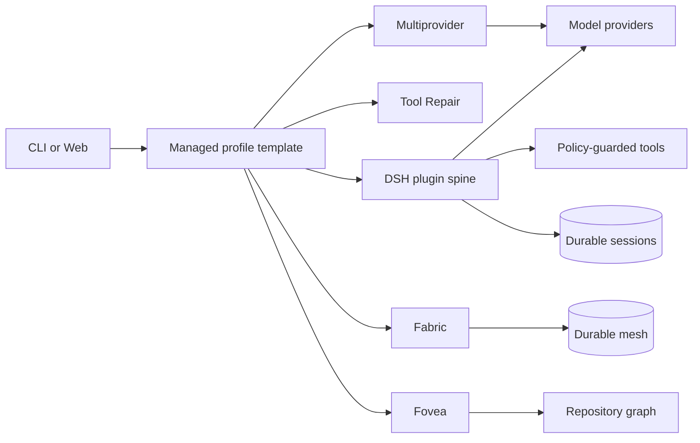

<div align="center">

# 🐟 DeepSeek Harness

**一个插件原生的编程 Agent Harness：一切都是插件。**

_本地一条命令即可运行，组合任意能力，并保持经过测试的发行版始终同步。_

[](https://github.com/ryan-brosas/deepseek-harness/actions/workflows/ci-fork.yml) [](https://www.npmjs.com/package/@monotykamary/dsh) [](package.json) [](LICENSE)

[English](README.md) | 中文

</div>

<a id="run"></a>

## 运行

```sh
npx @monotykamary/dsh@latest web
```

DeepSeek Harness（DSH）是一个构建于 vendored Cordis 之上的插件原生编码 Agent Harness：模型、工具、持久化、策略、UI 与编排全部是插件，因此你可以替换任一层而不触碰 Agent 循环。npm 包携带完整且经过测试的依赖闭包：[dsh-tool-repair](https://github.com/monotykamary/dsh-tool-repair)、[dsh-multiprovider](https://github.com/monotykamary/dsh-multiprovider)、[dsh-fabric](https://github.com/monotykamary/dsh-fabric) 与 [dsh-fovea](https://github.com/monotykamary/dsh-fovea) 会加入每个随附 profile，长生命周期 `web` profile 还包含 [dsh-factory](https://github.com/monotykamary/dsh-factory)；profile 从不固定独立副本。

DSH 优先在 `http://127.0.0.1:3080` 启动 Web UI；如果默认端口被占用，Web profile 会使用 OS 分配的回环端口重试一次并打印实际 URL，显式传入 `--port` 时仍严格使用指定端口。本机启动时还会用默认浏览器打开页面，SSH 启动时只打印宿主机 URL，传入 `--no-open` 可仅运行服务器。详见 [Web UI 指南](docs/user/guide/index.zh.md)。

## 为什么选择 DSH？

| | 能力 | 作用 |
| :-: | --- | --- |
| 🧩 | **一切皆插件** | 通过 Cordis 组合替换模型、工具、持久化、策略、UI 与编排。 |
| 🩹 | **内置工具修复** | 在记录或执行前重新校验无歧义的提供方格式修复；拒绝被截断的工作。 |
| 🔀 | **内置多账户提供方** | 保持提供方标识不变，通过感知健康状态的账户租约路由完整操作。 |
| 🧠 | **内置 Fabric** | 确定性压缩、受检代码执行、持久协作与实时拓扑。 |
| 🔭 | **内置 Fovea** | 渐进式仓库导航与影响分析，无需批量读取仓库。 |
| 🛡️ | **执行时策略** | 文件系统、子进程、审批、超时与沙箱决策均可由能力强制执行。 |
| 🔄 | **整体更新** | 设置与 CLI 同时报告 DSH 及每个 Companion 并保留安装渠道。 |
| 🧱 | **配置档分层** | 内置模板保持最新，用户补丁与外部 Bundle 保持独立所有权。 |

## 组合方式



Cordis 负责插件生命周期与可逆副作用；会话日志持有模型可见的持久事实，因此每个决策都可重建。配置档按顺序叠加安装拥有的模板、用户补丁、主目录补丁与命令行补丁，各来源保持独立所有权。详见[架构文档](docs/architecture.zh.md)。

## 安装

### 免安装运行

```sh
npx @monotykamary/dsh@latest web
```

### 安装命令

```sh
npm install --global @monotykamary/dsh@latest
dsh web
```

### Nix

```sh
nix run github:deepseek-ai/deepseek-harness
```

Flake 固定本检出版本对应的 npm 发行版。打包部署请设置 `DSH_INSTALL_CHANNEL=nix`，让设置页报告 Nix 拥有的更新渠道。

<a id="run-from-source"></a>

### 从源码运行

```sh
git clone https://github.com/deepseek-ai/deepseek-harness.git
cd deepseek-harness
pnpm install
pnpm run build
pnpm dsh web
```

## CLI 与更新

```sh
dsh --version
dsh version --json
dsh update --check
dsh update
dsh doctor --json
```

Web 设置面板包含**更新**页面，受管包有新版本时标记设置项。npm 全局安装可把更新交给分离 worker；npx、Nix、源码与未知安装则接收各自所有权的更新命令。DSH 绝不会静默替换自身或重启正在运行的会话。

## 配置档与插件

内置 `web` 与 `headless` 配置档从运行中的 DSH 安装解析模板，因此应用更新也会同步更新经过测试的 Tool Repair、Multiprovider、Fabric 与 Fovea 层。`$DSH_HOME/profiles/<name>/package.json` 只保存模板标识与用户管理的历史；`cordis.patch.yml` 仍是用户的覆盖层。

```sh
dsh --profile web --dump-config
dsh plugin --profile web add <package>
```

请为插件仓库添加 [`dsh-plugin`](https://github.com/topics/dsh-plugin) 主题。[扩展教程](docs/cookbook/extension-cookbook.zh.md)涵盖包、工具、模型提供方、设置卡片与浏览器界面。

## 文档

- [Web UI 指南](docs/user/guide/index.zh.md)
- [架构](docs/architecture.zh.md)
- [开发指南](docs/development.zh.md)
- [参与贡献](CONTRIBUTING.zh.md)
- [GitHub Discussions](https://github.com/deepseek-ai/deepseek-harness/discussions)
- [Discord](https://discord.gg/Ycq5dCaS4)

> [!WARNING]
>
> DSH 目前处于开发者预览阶段；首个正式版发布之前可能有不兼容变更。

## 许可证

MIT © DeepSeek 贡献者。第三方许可证见 [THIRD_PARTY_NOTICES.md](THIRD_PARTY_NOTICES.md)。